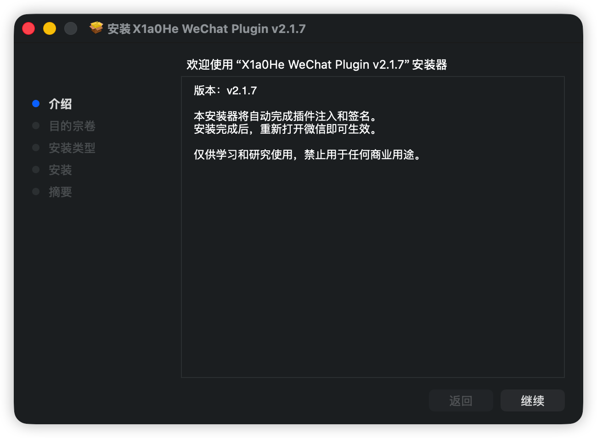

# X1a0He Plugin 2 for macOS


[](https://github.com/X1a0He/X1a0HeWeChatPlugin/releases)


macOS 客户端插件


> ✅ 已在以下环境中测试通过\
> 💻 设备: M1 Max macOS Tahoe 26.5 Beta (25F5042g)\
> 📒 微信版本: 4.1.8.100(37261)\
> ⚠️ 不一定会每个版本都支持 Intel\
> ❌ 不会支持 MAS 版本
> 
> MD5: 6094cae5e9714adfe849109d0cf104ca\
> SHA1: 45366ae49293169b185977fe516fcb312802d8b6\
> SHA256: e022f6586fe1f3b1ab8bd026e02e53393937738fd8384e103a156881b6f92164
> 
> 安装包 pkg SHA 256: 0b32505591ded95e2645ea84bca9f8cffff2dd145e3197d9e36694b61073cd4b

# 支持版本(点击版本或立即下载即可下载原版)
[版本记录](https://github.com/X1a0He/X1a0HeWeChatPlugin/issues/43)

|                                                 版本                                                 |  版本号  | 支持 | Arm | Intel | MAS | 下载原版                                                                                          |
|:--------------------------------------------------------------------------------------------------:|:-----:|:--:|:---:|:-----:|:---:|-----------------------------------------------------------------------------------------------|
|  [4.1.7.56](https://dldir1v6.qq.com/weixin/Universal/Mac/xWeChatMac_universal_4.1.7.56_34878.dmg)  | 34878 | ✅  |  ✅  |   ✅   |  ❌  | [立即下载](https://dldir1v6.qq.com/weixin/Universal/Mac/xWeChatMac_universal_4.1.7.56_34878.dmg)  |
|  [4.1.7.57](https://dldir1v6.qq.com/weixin/Universal/Mac/xWeChatMac_universal_4.1.7.57_34888.dmg)  | 34888 | ✅  |  ✅  |   ✅   |  ❌  | [立即下载](https://dldir1v6.qq.com/weixin/Universal/Mac/xWeChatMac_universal_4.1.7.57_34888.dmg)  |
|  [4.1.8.21](https://dldir1v6.qq.com/weixin/Universal/Mac/xWeChatMac_universal_4.1.8.21_36420.dmg)  | 36420 | ✅  |  ✅  |   ❌   |  ❌  | [立即下载](https://dldir1v6.qq.com/weixin/Universal/Mac/xWeChatMac_universal_4.1.8.21_36420.dmg)  |
|  [4.1.8.22](https://dldir1v6.qq.com/weixin/Universal/Mac/xWeChatMac_universal_4.1.8.22_36451.dmg)  | 36451 | ✅  |  ✅  |   ❌   |  ❌  | [立即下载](https://dldir1v6.qq.com/weixin/Universal/Mac/xWeChatMac_universal_4.1.8.22_36451.dmg)  |
|  [4.1.8.23](https://dldir1v6.qq.com/weixin/Universal/Mac/xWeChatMac_universal_4.1.8.23_36507.dmg)  | 36507 | ✅  |  ✅  |   ❌   |  ❌  | [立即下载](https://dldir1v6.qq.com/weixin/Universal/Mac/xWeChatMac_universal_4.1.8.23_36507.dmg)  |
|  [4.1.8.26](https://dldir1v6.qq.com/weixin/Universal/Mac/xWeChatMac_universal_4.1.8.26_36552.dmg)  | 36552 | ✅  |  ✅  |   ❌   |  ❌  | [立即下载](https://dldir1v6.qq.com/weixin/Universal/Mac/xWeChatMac_universal_4.1.8.26_36552.dmg)  |
|  [4.1.8.27](https://dldir1v6.qq.com/weixin/Universal/Mac/xWeChatMac_universal_4.1.8.27_36559.dmg)  | 36559 | ✅  |  ✅  |   ❌   |  ❌  | [立即下载](https://dldir1v6.qq.com/weixin/Universal/Mac/xWeChatMac_universal_4.1.8.27_36559.dmg)  |
|  [4.1.8.28](https://dldir1v6.qq.com/weixin/Universal/Mac/xWeChatMac_universal_4.1.8.28_36571.dmg)  | 36571 | ✅  |  ✅  |   ❌   |  ❌  | [立即下载](https://dldir1v6.qq.com/weixin/Universal/Mac/xWeChatMac_universal_4.1.8.28_36571.dmg)  |
|  [4.1.8.29](https://dldir1v6.qq.com/weixin/Universal/Mac/xWeChatMac_universal_4.1.8.29_36603.dmg)  | 36603 | ✅  |  ✅  |   ❌   |  ❌  | [立即下载](https://dldir1v6.qq.com/weixin/Universal/Mac/xWeChatMac_universal_4.1.8.29_36603.dmg)  |
|  [4.1.8.50](https://dldir1v6.qq.com/weixin/Universal/Mac/xWeChatMac_universal_4.1.8.50_36728.dmg)  | 36728 | ✅  |  ✅  |   ❌   |  ❌  | [立即下载](https://dldir1v6.qq.com/weixin/Universal/Mac/xWeChatMac_universal_4.1.8.50_36728.dmg)  |
|  [4.1.8.51](https://dldir1v6.qq.com/weixin/Universal/Mac/xWeChatMac_universal_4.1.8.51_36777.dmg)  | 36777 | ✅  |  ✅  |   ❌   |  ❌  | [立即下载](https://dldir1v6.qq.com/weixin/Universal/Mac/xWeChatMac_universal_4.1.8.51_36777.dmg)  |
|  [4.1.8.52](https://dldir1v6.qq.com/weixin/Universal/Mac/xWeChatMac_universal_4.1.8.52_36830.dmg)  | 36830 | ✅  |  ✅  |   ❌   |  ❌  | [立即下载](https://dldir1v6.qq.com/weixin/Universal/Mac/xWeChatMac_universal_4.1.8.52_36830.dmg)  |
|  [4.1.8.66](https://dldir1v6.qq.com/weixin/Universal/Mac/xWeChatMac_universal_4.1.8.66_36675.dmg)  | 36675 | ✅  |  ✅  |   ❌   |  ❌  | [立即下载](https://dldir1v6.qq.com/weixin/Universal/Mac/xWeChatMac_universal_4.1.8.66_36675.dmg)  |
|  [4.1.8.67](https://dldir1v6.qq.com/weixin/Universal/Mac/xWeChatMac_universal_4.1.8.67_36677.dmg)  | 36677 | ✅  |  ✅  |   ❌   |  ❌  | [立即下载](https://dldir1v6.qq.com/weixin/Universal/Mac/xWeChatMac_universal_4.1.8.67_36677.dmg)  |
|  [4.1.8.97](https://dldir1v6.qq.com/weixin/Universal/Mac/xWeChatMac_universal_4.1.8.97_37189.dmg)  | 37189 | ✅  |  ✅  |   ❌   |  ❌  | [立即下载](https://dldir1v6.qq.com/weixin/Universal/Mac/xWeChatMac_universal_4.1.8.97_37189.dmg)  |
|  [4.1.8.98](https://dldir1v6.qq.com/weixin/Universal/Mac/xWeChatMac_universal_4.1.8.98_37222.dmg)  | 37222 | ✅  |  ✅  |   ❌   |  ❌  | [立即下载](https://dldir1v6.qq.com/weixin/Universal/Mac/xWeChatMac_universal_4.1.8.98_37222.dmg)  |
| [4.1.8.100](https://dldir1v6.qq.com/weixin/Universal/Mac/xWeChatMac_universal_4.1.8.100_37261.dmg) | 37261 | ✅  |  ✅  |   ❌   |  ❌  | [立即下载](https://dldir1v6.qq.com/weixin/Universal/Mac/xWeChatMac_universal_4.1.8.100_37261.dmg) |

# 目录

* [如何安装](#如何安装)
    * [必要步骤](#必要步骤)
        * [已安装 Git 的用户](#已安装-git-的用户)
        * [未安装 Git 的用户](#未安装-git-的用户)
* [插件菜单预览](#插件菜单预览)
* [✨功能](#功能)
* [📝更新日志](#更新日志)
* [使用须知](#使用须知)
* [FAQ](#faq)
* [👨🏻‍💻作者](#作者)

# 如何安装

> 注意: 执行脚本需要输入你的 Mac 密码

## 必要步骤

### 推荐：使用 pkg 一键安装


### 已安装 Git 的用户

**Mac 上安装了 Git 的可以直接克隆仓库后执行脚本**

```shell
git clone https://github.com/X1a0He/X1a0HeWeChatPlugin.git
cd X1a0HeWeChatPlugin
sudo sh install.sh
```

### 未安装 Git 的用户

- 下载完整仓库压缩包后解压到相关目录\
  

- 完成解压后，打开`终端`\
  

执行以下命令

```shell
cd X1a0HeWeChatPlugin目录
sudo sh install.sh
```

**等待安装完成即可**

# 📝更新日志

- **更多更新日志，请查看 [更新日志](change-log.md)**

### 2.1.8 (2026.04.02)

1. 修复了启动崩溃的问题

<a href="https://star-history.com/#X1a0He/X1a0HeWeChatPlugin&Timeline">
 <picture>
   <source media="(prefers-color-scheme: dark)" srcset="https://api.star-history.com/svg?repos=X1a0He/X1a0HeWeChatPlugin&type=Timeline&theme=dark" />
   <source media="(prefers-color-scheme: light)" srcset="https://api.star-history.com/svg?repos=X1a0He/X1a0HeWeChatPlugin&type=Timeline" />
   
 </picture>
</a>

# 使用须知

**1. 不接受任何新功能请求**\
**2. 不接受任何类似以下几点的无脑issue**

- 怎么用？不会用？
- 会不会封号？
- 可以开源吗？

> ❌❌❌ 不再支持 3.X 版本，不要再叫了

# FAQ

- **会封号吗？**

> 所有处理均为本地处理，不经过任何网络传输，有能力的可以自行抓包检测\
> ⚠️ 多开功能不建议使用，因为本来官方就不支持多开

- **为什么不开源？有安全和隐私问题吗？**

> 为什么要开源？用人不疑，疑人不用\
> 另外，我不关心你的聊天记录，也不关心你的设备有多好，更不关心你的微信有多少钱，也不关心你人在哪里\
> 所以不会有任何安全和隐私问题，你可以放心使用，不放心随便检测

# 插件菜单预览


# ✨功能

- [x] 消息撤回拦截
    - [x] 防撤回他人消息
        - [x] 拦截语音消息
        - [x] 拦截动画表情消息
        - [x] 拦截位置消息
        - [x] 拦截图片消息
        - [x] 拦截文本消息
        - [x] 拦截个人名片消息
        - [x] 拦截视频消息
        - [x] 拦截其他类型消息
            - [x] 拦截小程序消息
            - [x] 拦截拍一拍消息
            - [x] 拦截文件消息
            - [x] 拦截合并转发消息
            - [x] 拦截引用消息
            - [x] 拦截音乐消息
    - [x] 防撤回自己消息【功能同上】
- [x] 允许微信多开 ⚠️请慎用该功能
- [x] 禁用日志上报
- [x] 禁用安全模式
- [x] 禁用检测更新
- [x] 禁用启动检查更新
- [x] 自定义设置撤回提示短语
- [x] 检测插件是否有新版本

# 👨🏻‍💻作者

X1a0He Plugin 2 for macOS © X1a0He

Created on 2025.01.20

> GitHub [@X1a0He](https://github.com/X1a0He/) \
> Telegram [@X1a0He](https://t.me/X1a0He_bot)
